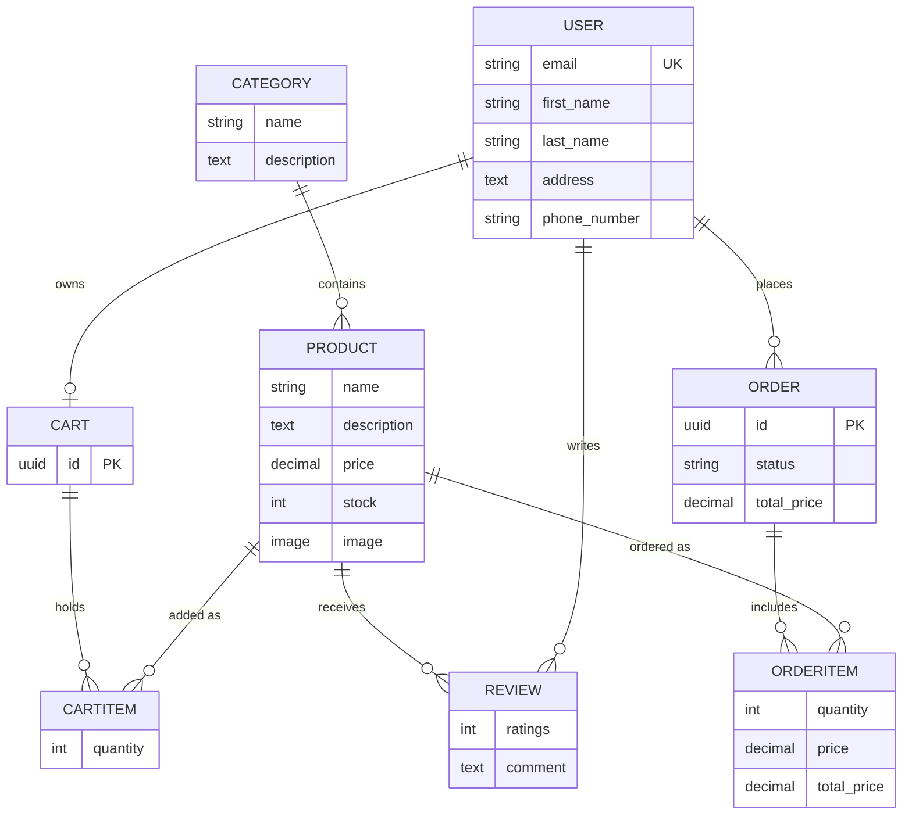
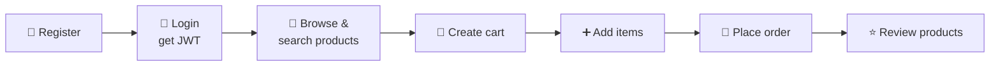

<div align="center">

# 🛒 Dokanly

### A RESTful E-Commerce API Backend

JWT authentication · Product catalog · Reviews · Cart · Orders

<br>


</div>

---

## 📑 Table of Contents

- [✨ Features](#-features)
- [🧰 Tech Stack](#-tech-stack)
- [🗂️ Project Structure](#️-project-structure)
- [🧬 Data Model](#-data-model)
- [🚀 Getting Started](#-getting-started)
- [📡 API Reference](#-api-reference)
- [🔄 Typical User Flow](#-typical-user-flow)
- [👨‍💻 Author](#-author)

---

## ✨ Features

| | Feature | Details |
|---|---|---|
| 🔐 | **Custom User Model** | Email-based login (no username), plus address & phone number |
| 🪪 | **JWT Authentication** | Registration, login and token refresh via Djoser + SimpleJWT |
| 📦 | **Products & Categories** | Full CRUD, public reads, admin-only writes, per-category product count |
| 🔎 | **Search, Filter & Sort** | Search by name/description/category, filter by category & price range, order by price |
| 📄 | **Pagination** | 10 items per page out of the box |
| ⭐ | **Reviews** | Nested under products, 1–5 rating + comment, only the author (or staff) can edit/delete |
| 🧺 | **Shopping Cart** | One cart per user, duplicate products merge quantities automatically |
| 🧾 | **Orders** | Cart → order conversion with price snapshots per line item |
| 🛡️ | **Role-based Access** | Users see only their own orders, staff see everything |

**Order statuses:** `Not Paid` · `Ready To Ship` · `Shipped` · `Delivered` · `Canceled`

---

## 🧰 Tech Stack

| Layer | Tools |
|---|---|
| **Framework** | Django 6.1, Django REST Framework 3.18 |
| **Authentication** | Djoser, djangorestframework-simplejwt |
| **Filtering** | django-filter |
| **Nested Routes** | drf-nested-routers |
| **Config** | python-decouple |
| **Database** | SQLite (default) |
| **Dev Tools** | django-debug-toolbar |

---

## 🗂️ Project Structure

```
Dokanly/
├── Dokanly/       # Project settings & root URLs
├── api/           # Central API router, shared permissions
├── product/       # Category, Product, Review (models, views, filters, pagination)
├── order/         # Cart, CartItem, Order, OrderItem
├── users/         # Custom User model, manager, Djoser serializers
├── fixtures/      # Sample product & category data
├── requirements.txt
└── manage.py
```

---

## 🧬 Data Model



---

## 🚀 Getting Started

### 1️⃣ Clone the repository

```bash
git clone https://github.com/ashrafulX/Dokanly.git
cd Dokanly
```

### 2️⃣ Create a virtual environment & install dependencies

```bash
python -m venv venv
source venv/bin/activate        # Windows: venv\Scripts\activate
pip install -r requirements.txt
```

> 💡 Requires **Python 3.12+** (Django 6.x).

### 3️⃣ Configure environment variables

Create a `.env` file in the project root (next to `manage.py`):

```env
SECRET_KEY=your-secret-key-here
```

### 4️⃣ Apply migrations

```bash
python manage.py migrate
```

### 5️⃣ Load sample data *(optional)*

```bash
python manage.py loaddata fixtures/product_data.json
```

### 6️⃣ Create a superuser & run the server

```bash
python manage.py createsuperuser
python manage.py runserver
```

| | URL |
|---|---|
| 🌐 API | `http://127.0.0.1:8000/api/v1/` |
| 🛠️ Admin | `http://127.0.0.1:8000/admin/` |

---

## 📡 API Reference

**Base URL:** `/api/v1/`

Protected endpoints expect this header:

```
Authorization: JWT <access_token>
```

### 🔐 Authentication

| Method | Endpoint | Description |
|---|---|---|
| `POST` | `/auth/users/` | Register a new user |
| `POST` | `/auth/jwt/create/` | Login with email + password → access & refresh tokens |
| `POST` | `/auth/jwt/refresh/` | Refresh the access token |
| `GET` | `/auth/users/me/` | Current user profile |

### 📦 Products & Categories

| Method | Endpoint | Access | Description |
|---|---|---|---|
| `GET` | `/products/` | 🌍 Public | List products (paginated) |
| `POST` | `/products/` | 👑 Admin | Create a product |
| `GET` `PUT` `PATCH` `DELETE` | `/products/{id}/` | 🌍 read · 👑 write | Product detail |
| `GET` `POST` | `/categories/` | 🌍 read · 👑 write | List / create categories |
| `GET` `PUT` `PATCH` `DELETE` | `/categories/{id}/` | 🌍 read · 👑 write | Category detail |

<details>
<summary><b>🔎 Query parameters for <code>/products/</code></b></summary>

<br>

| Param | Example | Description |
|---|---|---|
| `search` | `?search=laptop` | Search in name, description and category name |
| `category_id` | `?category_id=1` | Filter by category |
| `price__gt` / `price__lt` | `?price__gt=100&price__lt=500` | Filter by price range |
| `ordering` | `?ordering=-price` | Sort by price (prefix `-` for descending) |
| `page` | `?page=2` | Page number (10 per page) |

</details>

### ⭐ Reviews

| Method | Endpoint | Access | Description |
|---|---|---|---|
| `GET` | `/products/{product_id}/reviews/` | 🌍 Public | List reviews of a product |
| `POST` | `/products/{product_id}/reviews/` | 🔑 Authenticated | Add a review |
| `PUT` `PATCH` `DELETE` | `/products/{product_id}/reviews/{id}/` | ✍️ Author or staff | Edit / delete a review |

### 🧺 Cart

| Method | Endpoint | Description |
|---|---|---|
| `POST` | `/carts/` | Create a cart for the logged-in user |
| `GET` | `/carts/{cart_id}/` | View the cart with items and total price |
| `DELETE` | `/carts/{cart_id}/` | Delete the cart |
| `GET` | `/carts/{cart_id}/items/` | List cart items |
| `POST` | `/carts/{cart_id}/items/` | Add an item → `{"product_id": 1, "quantity": 2}` |
| `PATCH` | `/carts/{cart_id}/items/{id}/` | Update quantity |
| `DELETE` | `/carts/{cart_id}/items/{id}/` | Remove an item |

### 🧾 Orders

| Method | Endpoint | Description |
|---|---|---|
| `POST` | `/orders/` | Place an order → `{"cart_id": "<uuid>"}` (the cart is cleared afterwards) |
| `GET` | `/orders/` | List your orders (staff see all) |
| `GET` | `/orders/{id}/` | Order detail with line items |

---

## 🔄 Typical User Flow



<details>
<summary><b>💻 Try it with cURL</b></summary>

<br>

```bash
# 1. Register
curl -X POST http://127.0.0.1:8000/api/v1/auth/users/ \
  -H "Content-Type: application/json" \
  -d '{"email":"user@example.com","password":"StrongPass123","first_name":"John","last_name":"Doe"}'

# 2. Login
curl -X POST http://127.0.0.1:8000/api/v1/auth/jwt/create/ \
  -H "Content-Type: application/json" \
  -d '{"email":"user@example.com","password":"StrongPass123"}'

# 3. Create a cart
curl -X POST http://127.0.0.1:8000/api/v1/carts/ \
  -H "Authorization: JWT <access_token>"

# 4. Add an item to the cart
curl -X POST http://127.0.0.1:8000/api/v1/carts/<cart_id>/items/ \
  -H "Authorization: JWT <access_token>" \
  -H "Content-Type: application/json" \
  -d '{"product_id":1,"quantity":2}'

# 5. Place the order
curl -X POST http://127.0.0.1:8000/api/v1/orders/ \
  -H "Authorization: JWT <access_token>" \
  -H "Content-Type: application/json" \
  -d '{"cart_id":"<cart_id>"}'
```

</details>

---

## 👨‍💻 Author

<div align="center">

**Ashraful**

[](https://github.com/ashrafulX)

⭐ If you find this project useful, consider giving it a star!

</div>